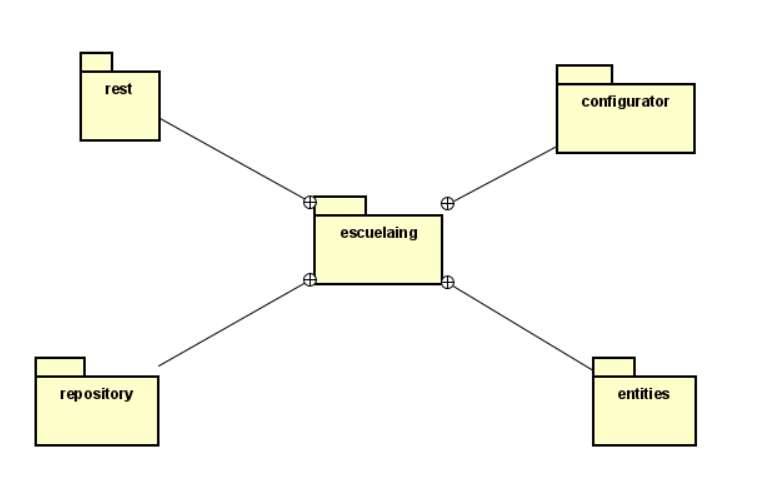
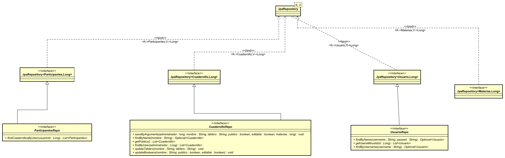

[](https://dl.circleci.com/status-badge/redirect/gh/juanbaezl/EciNotes/tree/main)

[](https://www.codacy.com/gh/juanbaezl/EciNotes/dashboard?utm_source=github.com&utm_medium=referral&utm_content=juanbaezl/EciNotes&utm_campaign=Badge_Grade)

# Titulo

ECI Notes

## Descripción

ECI Notes es una aplicación web la cual le permitirá realizar apuntes colaborando en tiempo real junto a sus compañeros, esto con el fin de que sus apuntes sean más completos.

También en caso de querer estos apuntes serán guardados en un repositorio global, con el fin de que otros usuarios de la ECI puedan usar estos.

El proyecto lo puede ver en el siguiente link:
[App Eci Notes](https://ecinotes.herokuapp.com/)

### LOC/h

Para este taller se hicieron 936 líneas de código, en 52 horas.

**18 LOC/h**

### Prerrequisitos

Para correr este se debe tener instalado:

- Maven
- Java

### Guía de uso

Para compilar el proyecto se debe usar:

```
mvn package
```

Para ejecutarlo, se debe hacer de la siguiente forma

```
$ java -jar target/ECINotes-1.0.jar
```

Este le iniciará la página en su localhost con puerto 5000.

## Documentación

Para visualizar la documentación se debe ejecutar el siguiente comando:

```
mvn javadoc:javadoc
```

Una vez se realice este comando, se debe buscar en la siguiente ruta "target\site\apidocs\index.html".

## Estructura de Archivos

    .
    |____pom.xml
    |____src
    | |____main
    | | |____java
    | | | |____co
    | | | | |____edu
    | | | | | |____escuelaing
    | | | | | | |____configurator
    | | | | | | | |____CollabTableroWebSocketConfig.java
    | | | | | | |____entities
    | | | | | | | |____Cuadernillo.java
    | | | | | | | |____Materias.java
    | | | | | | | |____Participantes.java
    | | | | | | | |____Usuario.java
    | | | | | | |____repository
    | | | | | | | |____CuadernilloRepo.java
    | | | | | | | |____MateriasRepo.java
    | | | | | | | |____ParticipantesRepo.java
    | | | | | | | |____UsuarioRepo.java
    | | | | | | |____rest
    | | | | | | | |____CuadernilloRest.java
    | | | | | | | |____ParticipantesRest.java
    | | | | | | | |____UsuarioRest.java
    | | | | | | | |____WebRest.java
    | | | | | | |____services
    | | | | | | | |____CuadernilloServices.java
    | | | | | | | |____MateriasServices.java
    | | | | | | | |____ParticipantesServices.java
    | | | | | | | |____UsuariosServices.java
    | | | | | | |____WebSiteController.java
    | |____resources
    | | |____static
    | | | |____js
    | | | | |____Modal.js
    | | | | |____Cuadernillo.js
    | | | | |____FirstComponent.js
    | | | | |____Home.js
    | | | | |____Index.js
    | | | | |____Sketch.js
    | | | |____css
    | | | | |____style.css
    | | | | |____home.css
    | | | | |____index.css
    | | | | |____modal.css
    | | | |____status.html
    | | | |____home.html
    | | | |____index.html
    | | | |____tablero.html



## Diagramas de Clases


### Configurator


### Entities


### Repository



### Rest


### Services


## Autor

- **Juan Carlos Baez Lizarazo** - [juanbaezl](https://github.com/juanbaezl)

## Licencia

Para más información ver: [LICENSE.txt](License.txt)
